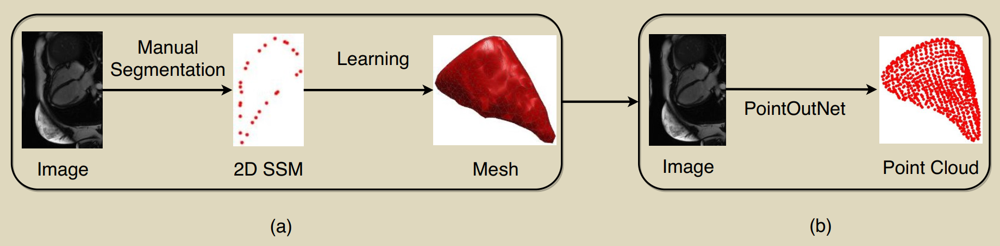
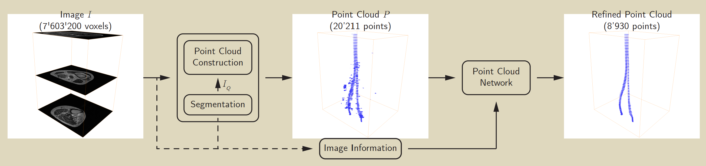

# Point Cloud and Voxel Representation in Medical Images

## Overview

[1.](#1) [PointOutNet: One-stage Shape Instantiation from a Single 2D Image to 3D Point Cloud (MICCAI 2019)](https://arxiv.org/pdf/1907.10763) 

[2.](#2) [Learning Shape Representation on Sparse Point Clouds for Volumetric Image Segmentation (MICCAI 2019)](https://arxiv.org/pdf/1906.02281)

[3.](#3) [Point-Unet: A Context-Aware Point-Based Neural Network for Volumetric Segmentation (MICCAI 2021)](https://sonhua.github.io/pdf/ho-point_unet-miccai21.pdf)

## Summary table

| Name | Publish | Insight | Method | Datasets | Experiments | Notes |
| :---: | :---: | :--- | :--- | :--- | :--- | :--- |
| [PointOutNet](#1) | MICCAI 2019 | Directly generate the target surface points from 2D images | 2D FC encoder and decode to be points | 27 Right Ventricle points labels on MR images(private) | Compare with partial LS regression methods | Deirectly generate point clouds |
| [Learning Shape Representation ...](#2) | MICCAI 2019 | | | | | [code](https://github.com/fabianbalsiger/point-cloud-segmentation-miccai2019) |
| [Point-UNet](#3) | MICCAI 2021 | | | | | [code](https://github.com/VinAIResearch/Point-Unet) |

## [1. PointOutNet: One-stage Shape Instantiation from a Single 2D Image to 3D Point Cloud (MICCAI 2019)](#1)

### Insight
Reconstruct a point cloud(surface vertices of target) from a single 2D image

### Method
 - Encode the 2D image with a fully conv layers
 - Apply an MLP to decode and directly get the output points  

### Datasets
 - 27 Right Ventricle points labels on MR images with 601 experiments (could be 601 2D images)
 - private

### Experiments
 - Define a PC-to-PC error (directional chamfer distance) 
 - The error and process time of different patiants
 - Comparison with two-stage shape instantiation methods PLSR(partial LS regression) and KPLSR. 

## [2. Learning Shape Representation on Sparse Point Clouds for Volumetric Image Segmentation (MICCAI 2019)](#2)

### Insight
Convert voxel into sparse point cloud can benefit segmentation on tabular ROI

### Method
 - Generate a probability map on voxels and filter the points
 - Apply semantic segmentation on point cloud 

### Dateset
Segmentation of peripheral nerve on 52 MRN images (10/42 for healthy volunteers and patients, private)

### Experiment
 - They provide an ablation study on proposed method and CNN baselines
 - They do not compare their method with existing approaches.

## [3. Point-Unet: A Context-Aware Point-Based Neural Network for Volumetric Segmentation (MICCAI 2021)](#3)

### Insight
first predict the regions of interest in the volume by learning an attentional probability
map, which is then used for sampling the volume into a sparse point cloud
that is subsequently segmented using a point-based neural network

### Method

 - Predict ROIs by learning a prob map
 - Sample a sparse point cloud given the prob map
 - Segment using a point-based network

### Datasets
[BraTS18](https://www.med.upenn.edu/sbia/brats2018/data.html), [BraTS19](https://www.med.upenn.edu/cbica/brats2019/data.html), [BraTS20](https://www.med.upenn.edu/cbica/brats2020/data.html) and [Pancreas](https://wiki.cancerimagingarchive.net/display/Public/Pancreas-CT) datasets

### Experiments
 - Comprehensive comparison experiments and ablation study
 - Competitive with sota. methods 

