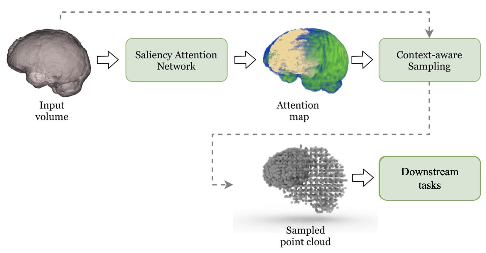

<!--
 * @Author: PunkQ
 * @Date: 2022-01-19 01:37:13
 * @LastEditTime: 2022-01-19 09:27:14
 * @LastEditors: PunkQ
 * @Description: brief summary of our plan
 * @FilePath: /punkq.github.io/docs/projects/voxel_point_cloud/22_01_19_proposal.md
-->

# Proposal: Point Cloud Representation for detection in 3D medical images

## Insight 

Point representations outperform volume representations on computational efficiency and geometric invariance for existing deep learning methods. Existing method, [Point-UNet](https://github.com/VinAIResearch/Point-Unet) for instance, proves that point representations benefit predicting the semantic labels on 3D medical images. Yet, 3D medical detection is of high significance and clinical relevance because rating of ROIs dominate the diagnosis. Therefore, point representations for 3D medical detection are worth exploring. 

## Plans

1. Generate 2D propability maps / a 3D propability map (semantic segmentation)
2. Sample points on 3D images given the learned map (dense voxels to sparse points)
3. Apply point-based learning for detection (point cloud representation)

## Open-source methods

 - [Point-UNet](https://github.com/VinAIResearch/Point-Unet): (MICCAI 2021) Using point-based method for 3D segmentation 
 - [nnDetection](https://github.com/MIC-DKFZ/nnDetection): (MICCAI 2021) A robust pipeline proposed by the team who made [nnU-Net](https://github.com/MIC-DKFZ/nnUNet) 

 - [RibSeg(MICCAI 2021)](https://github.com/M3DV/RibSeg)

 - [Ponit Cloud Segmentation(MICCAI 2019)](https://github.com/fabianbalsiger/point-cloud-segmentation-miccai2019)
## Datasets

| Task | Movitation |
|:--: | :-- |
| [RibFrac](https://github.com/MIC-DKFZ/nnDetection/blob/main/projects/Task020_RibFrac/README.md) |A new dataset and not hard to outperform existing methods |
|[Pancreas](https://github.com/MIC-DKFZ/nnDetection/blob/main/projects/Task001_Decathlon/README.md)| Current open-source methods [Point-UNet](https://github.com/VinAIResearch/Point-Unet) and [nnDetection](https://github.com/MIC-DKFZ/nnDetection) are conducted test on this dataset |

