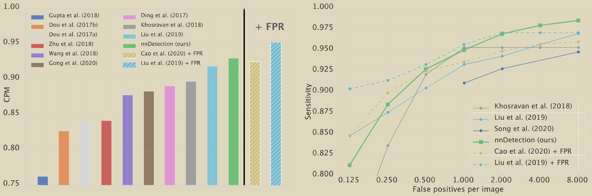
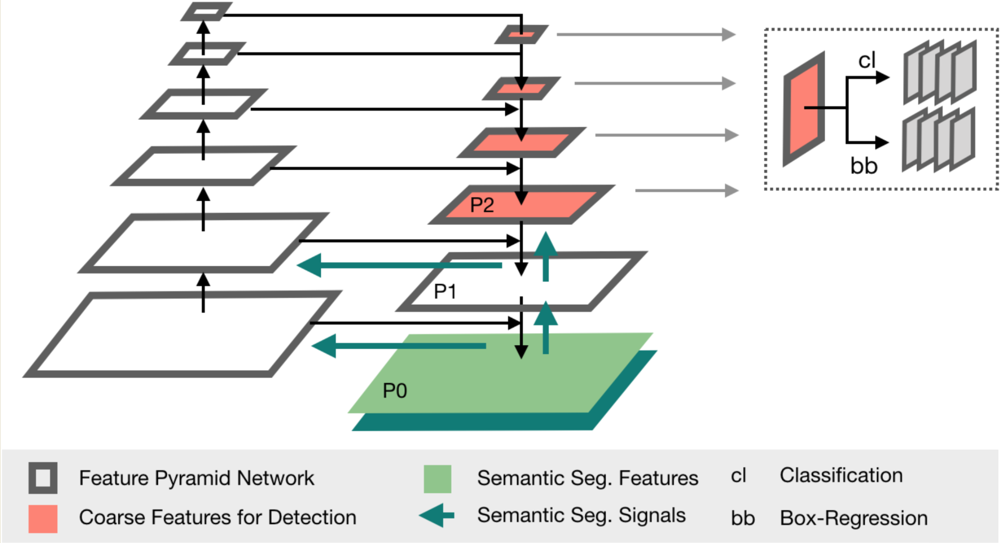
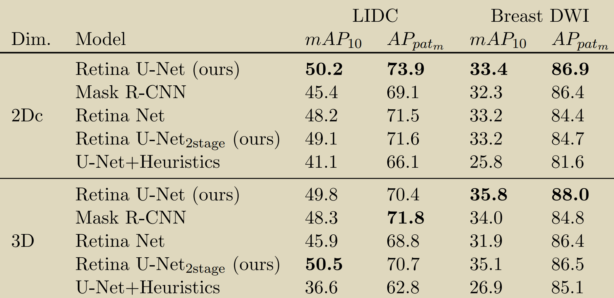

# [nnDetection: A Self-configuring Method for Medical Object Detection](https://miccai2021.org/openaccess/paperlinks/2021/09/01/341-Paper1836.html#author-id)

## Insight
Similar as nnU-Net, nndetection applys a set of fixed, rule-based, empirical design choice for medical image detection pipeline.

## Dataset for medical detection
1. [LUNA 16](https://luna16.grand-challenge.org/) (claims sota performance)
2. [ADAM](https://amd.grand-challenge.org/Home/) 2D fundus image
3. [LIDC](https://wiki.cancerimagingarchive.net/display/Public/LIDC-IDRI)
4. [Decathelon](https://decathlon-10.grand-challenge.org/)
etc.

## Method
1. Pipeline follows the architecture of [Retina U-Net](#retina u-net)
2. Automaticly convert the segmentation tasks, such as Decathelon, into the detection tasks
3. Specifically, they generate connected components labels by target (tumor but not organs) mask to and ingore all the objects with diameters less than 3mm.

## Experiment
 - compared with others methods on LUNA 16
 - compared with the baseline -- nnU-Net + postprocess object scoring

## Notes
 - Medical object detection lacks public data compared to segmentation 
 - They propose a new benchmark on existing sementation challenges 
 - The code for conversion between segmentation and detection follows

# [Retina U-Net: Embarrassingly Simple Exploitation of Segmentation Supervision for Medical Object Detection](https://arxiv.org/abs/1811.08661)

## Insight
Adding detection branches on U-Net decoder layers is feasible for medical image detection

## Dataset
1. [LIDC](https://wiki.cancerimagingarchive.net/display/Public/LIDC-IDRI)
2. An in-house breast lesion detection and classification with 331 patients of MRI data
3. Toy experiments(synthetic data built by their own)

## Method
1. A U-Net architecture build upon FPN
2. The last layer of decoder output the segmentation mask
3. Detection branchs added for the decoder layers
4. Post-process fusion for predicted bounding boxes 

## Experiment
 - Baselines: Mask R-CNN, Faster R-CNN; U-Net + heuristics; Retina U-Net with 2 stages
 
